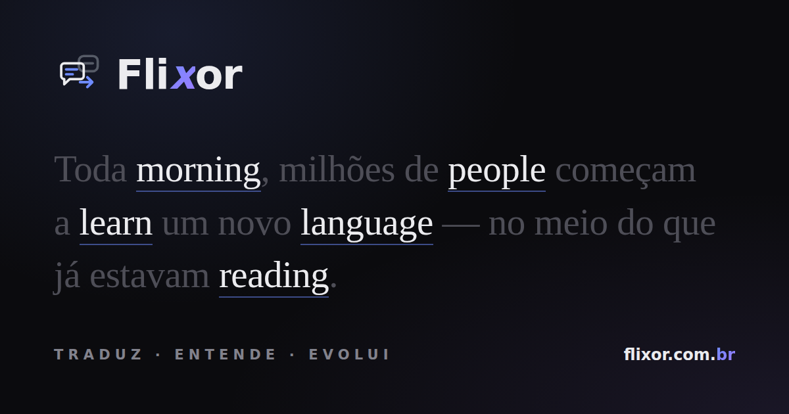
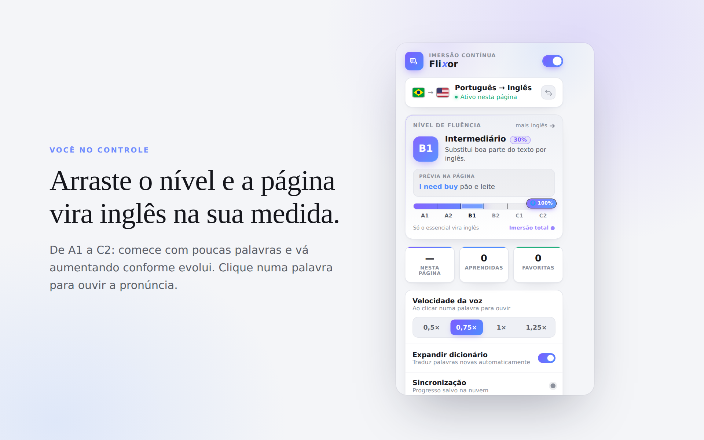
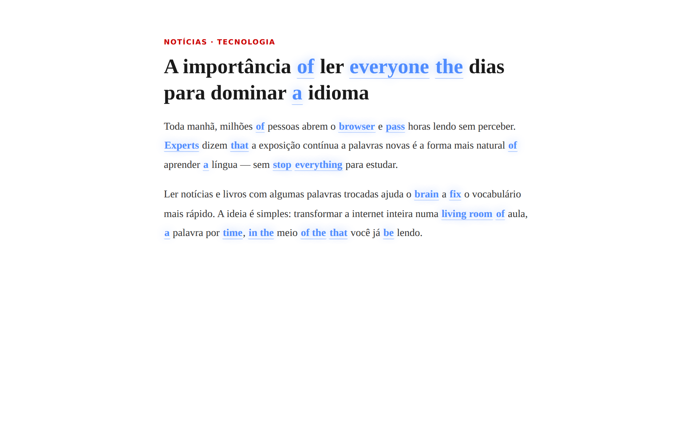
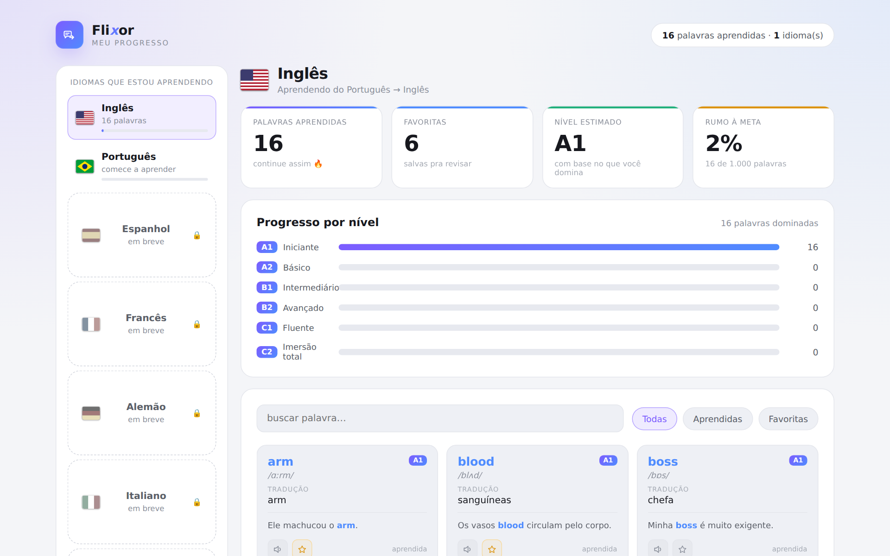

<div align="center">



# Flixor

### Aprenda um idioma sem parar o que você faz.

Uma extensão de navegador que troca **algumas palavras** de qualquer página pelo
idioma que você está aprendendo. Você continua lendo o que já leria — e vai
absorvendo vocabulário, **uma palavra por vez**.

**Traduz · Entende · Evolui**


⭐ **Curtiu a ideia? Deixa uma estrela — ajuda demais o projeto!** ⭐

[**🌐 Site**](https://flixor.com.br) · [**⬇️ Instalar (beta)**](https://flixor.com.br/instalar)

</div>

---

## ✨ O que é

Estudar idioma normalmente pede que você **pare tudo** para abrir um app. A Flixor
inverte isso: ela injeta o idioma-alvo no meio do que você **já faz** — notícias,
artigos, redes, documentação. A cada página, algumas palavras aparecem no outro
idioma, destacadas. Passe o mouse para ver a tradução, clique para ouvir a
pronúncia, marque como aprendida. Sem cadastro, sem sair do fluxo.

## 🎯 Recursos

- **Régua de fluência A1 → C2** — você decide quantas palavras viram o outro idioma. Comece com poucas e aumente conforme evolui.
- **Português ⇄ Inglês**, nos dois sentidos.
- **Dicionário 100% offline** (~50 mil palavras) + expansão automática da cauda longa.
- **Pronúncia ao clicar**, com velocidade ajustável (0,5× a 1,25×).
- **Leitor de PDF com imersão** — abra um PDF e leia com as palavras já trocadas.
- **Legenda de vídeo traduzida** — com o CC ligado, as falas viram imersão em tempo real.
- **Painel de progresso** — palavras aprendidas, favoritas e evolução por nível.
- **Privacidade em primeiro lugar** — dicionário offline, progresso no seu aparelho, sem rastreamento.

## 📸 Como fica

|  |  |
|--|--|
|  |  |
| **Você no controle** — arraste o nível e a página vira inglês na sua medida. | **Imersão real** — palavras trocadas ao vivo em qualquer site. |



## 🚀 Instalar (beta)

Ainda não estamos na Chrome Web Store — mas dá pra testar em 1 minuto direto pelo site,
com passo a passo e imagens:

### 👉 **[flixor.com.br/instalar](https://flixor.com.br/instalar)**

(baixe o pacote, abra `chrome://extensions`, ligue o **Modo desenvolvedor** e clique em **Carregar sem compactação**.)

## 🧠 Como funciona

```
content script  → lê os nós de texto da página e troca palavras (respeitando o nível)
leitor de PDF   → extrai o texto do PDF (pdf.js) e aplica a mesma imersão
service worker  → traduz a cauda longa sob demanda (cache global na nuvem)
dicionário      → 50k palavras offline embutidas + cache remoto incremental
```

## 🛣️ Roadmap

- [x] Imersão por nível em qualquer página
- [x] Pronúncia + velocidade da voz
- [x] Painel de progresso por idioma
- [x] Leitor de PDF com imersão
- [x] Tradução da legenda (CC) de vídeo em tempo real
- [ ] Transcrição da fala on-device (vídeos sem legenda)
- [ ] Novos idiomas (Espanhol, Francês, Alemão, Italiano, Japonês)

## 🛠️ Stack

Chrome Manifest V3 · pdf.js · Supabase (edge function) · Web Speech API

---

<div align="center">

Se a Flixor te ajudou a aprender uma palavra nova hoje, **deixa uma ⭐** — é o que move o projeto.

<sub>Traduz. Entende. Evolui. · <a href="https://flixor.com.br">flixor.com.br</a></sub>

</div>
